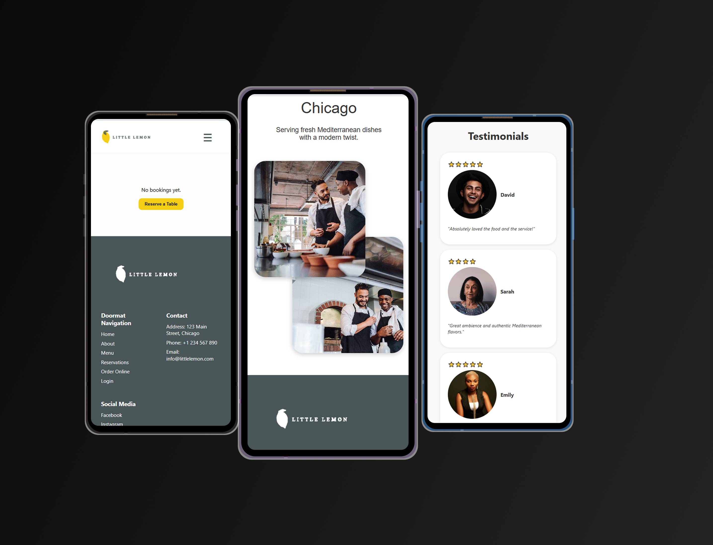

# Little Lemon Restaurant - Frontend Reservation App 🍋

This is a responsive restaurant reservation web app built as a **capstone project** for the **Meta Front-End Developer Professional Certificate (Coursera)**. It includes a user-friendly booking system that dynamically prevents double bookings and provides a seamless reservation flow from start to confirmation.

---

## ✨ Features

### ✅ Main Landing Page
- Hero section with promotional content
- Sections like **About**, **Menu**, and **Testimonials** (structure only)
- Responsive layout for desktop and mobile

### ✅ Booking Page
- **Interactive reservation form**
- Prevents double booking by **disabling already reserved time slots** per day
- Form validation
- Responsive layout:
  - Desktop: text on left, large vertical image stack, and form on right
  - Mobile: stacked layout with **image slideshow**
- Real-time reservation storage using `localStorage`

### ✅ Reservation Table Page
- Displays all previously made reservations
- Responsive display:
  - Table on desktop
  - Card layout on mobile for better readability
- Includes “Reserve a Table” call-to-action

### ✅ Confirmation Page
- Displays success message after booking
- Responsive design
- Integrated Header & Footer for full app structure

### ✅ Reusable Layout
- Component-based structure using **React**
- Reusable `Header` and `Footer`
- Routing via `react-router-dom`

---

## 🔧 Technologies Used

- **React.js** (Vite)
- **JavaScript (ES6+)**
- **HTML5 / CSS3**
- **Responsive Design (Media Queries & Flex/Grid)**
- `localStorage` for data persistence
- React Router for navigation

---
## 📁 Folder Structure

src/
│
├── component/ # Header, Footer, MainPage, BookingForm, MobileCarousel
├── pages/ # HomePage, BookingPage, BookingTable, ConfirmationPage
├── public/ # Images and media
├── App.js
├── index.js
└── api.js
└── App.css

---

## Getting Started

To run the project locally:

1. Clone the repo:
   git clone https://github.com/JOULifestyle/little-lemon-app.git
Navigate and install dependencies:

cd little-lemon-booking
npm install
Start the development server:

npm start
Visit http://localhost:3000

---

🔗 Live Demo
👉 View live on Vercel: https://little-lemon-app-zeta.vercel.app

---

## 🎨 UI/UX Design

I designed both the **wireframe** and **interactive prototype** of this application using **Figma**, focusing on clean layout, usability, and responsiveness from mobile to desktop.

📸 Wireframe & Prototype:

---
## 📷 App Screenshots
### Mobile View

### Tablet/Desktop View

---

📌 Project Status
✅ Completed core features
⏳ Optional features not implemented:

-Login / Auth

-Online Delivery Ordering Page

-About Page

📣 Attribution
This project was completed as part of the Meta Front-End Developer Professional Certificate on Coursera.

---

#### ✅ Loom video
https://www.loom.com/share/36f8e26633bc47bda71ca128270ade57?sid=840e3415-3ba4-4a9b-949e-c3afb08b6680

